# Ablox Games

[Ablox](https://github.com/prak59459-create/Ablox) の「ゲーム」タブが読むゲーム一覧です。
80本のゲームが入っています。どれも Ablox Studio で開いて、そのまま改造できます。

> The public game list for Ablox: 80 games, each a world plus `.absc` scripts.
> The app reads `index.json` straight from this repository.

## 遊び方

1. iPad の Ablox で **設定 → ゲーム一覧** を開く
2. リポジトリは `prak59459-create/AbloxGames`（最初から入っています）
3. ブランチは、このブランチを使うなら `claude/ablox-ipad-platform-8e8d8m`、`main` に入ったら `main`
4. 「ゲーム」タブで遊びたいゲームを選んでダウンロード → ホスト

Ablox Studio の「公開ゲームを開く」からも、同じ一覧のゲームをプロジェクトとして開けます。

## ゲーム一覧

<!-- games:start -->
### 🔥 人気の定番

| | # | ゲーム | 内容 |
|---|---|---|---|
| 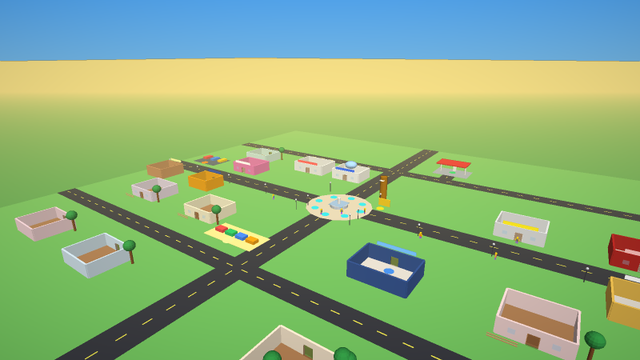 | 1 | **Maple Bay Life RP** | 街でくらすロールプレイ。家に住んで、仕事を選んで、車やジェットパックで走り回ろう。勝ち負けなし、友だちとのんびり交流。 |
| 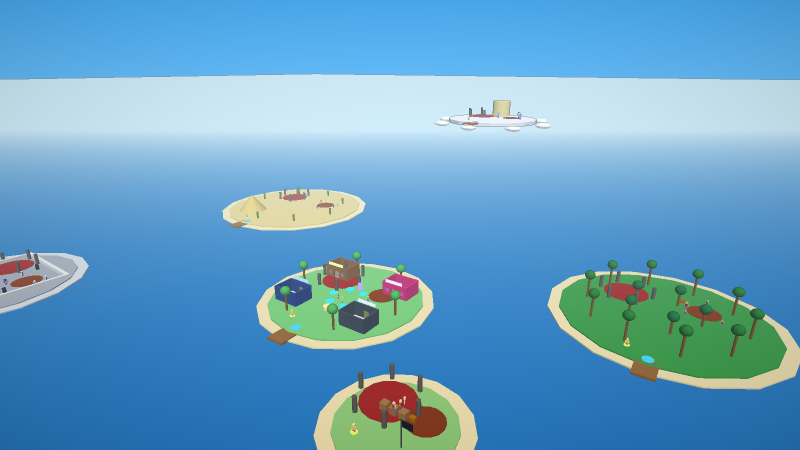 | 2 | **Fruit Seas Adventure** | ふしぎな果実を食べて技を覚え、剣をきたえて島から島へ。山賊をたおしてレベルアップ、海の巨人ボスにみんなで挑もう。 |
| 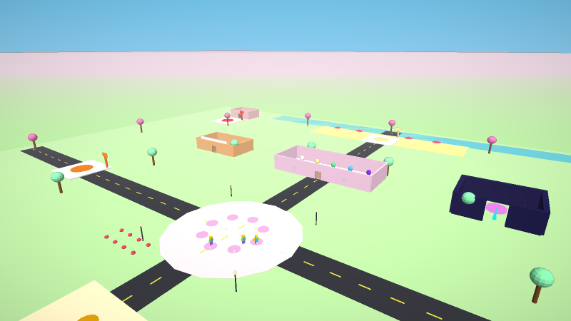 | 3 | **Pet Home Paradise** | たまごを買ってかえし、ペットを育てよう。お世話をするとコインがもらえてペットが大きくなる。レアなペットを集めて友だちにプレゼントも。 |
| 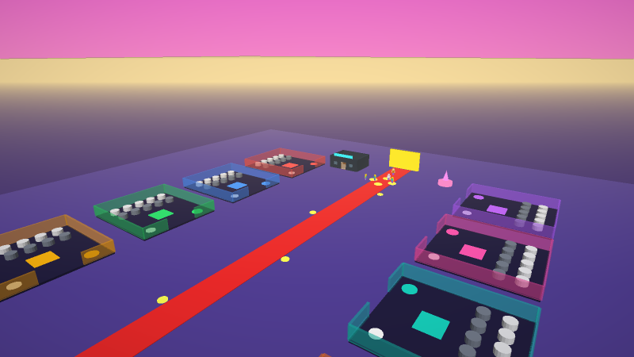 | 4 | **Meme Heist** | ランウェイを歩くヘンなミームキャラを買って自分の基地へ。キャラはお金を生み出す。ほかの人の基地からこっそり盗み出せ！ |
| 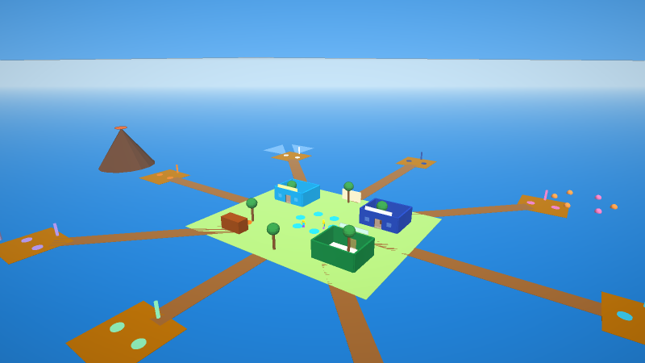 | 5 | **Reel Legends** | つりのアドベンチャー。タイミングよくリールを引いて魚をつり上げ、売ってロッドを強化。池、海、深海、火山湖で伝説の魚を探そう。 |
| 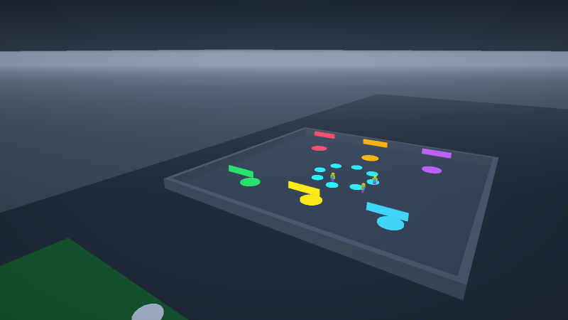 | 6 | **Clash Duels** | 1対1から5対5まで、短い試合で勝負するFPS。ラウンドごとに武器を選んで、先に5ラウンド取ったチームの勝ち。 |
| 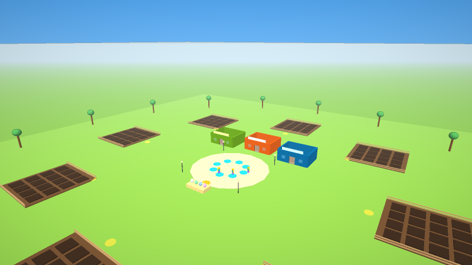 | 7 | **Sprout Garden** | 自分の畑にタネをまいて、育ったら収穫して売ろう。雨や虹のイベントで作物がパワーアップ。レアなタネで夢の庭園を。 |
| 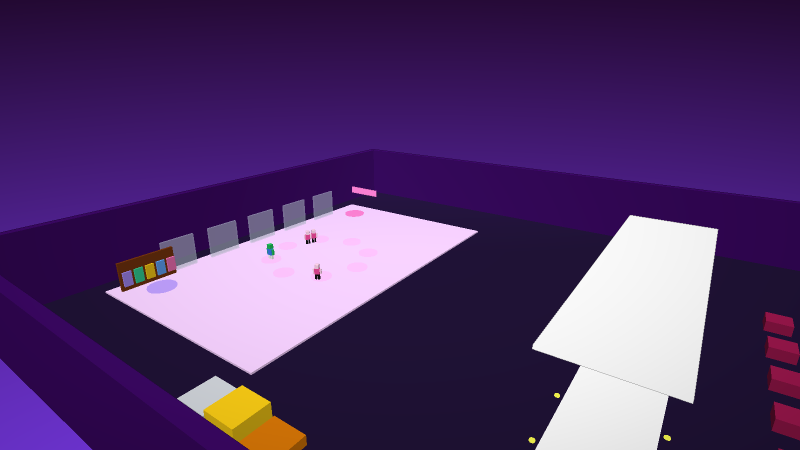 | 8 | **Runway Star** | テーマに合わせて服の色や帽子をコーディネートしてランウェイへ。みんなで星をつけ合って、トップモデルを決めよう。 |
| 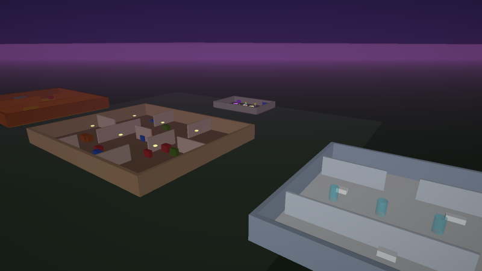 | 9 | **Mystery Manor** | 市民・保安官・犯人に分かれる推理サバイバル。犯人は正体をかくして全員を、保安官は犯人を見つけてたおせ。市民は生きのこれ！ |
| 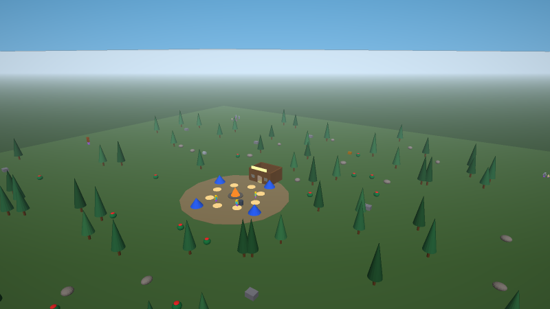 | 10 | **99 Nights Camp** | 森のキャンプで99日を生きのびるサバイバル。昼は木を切ってたき火を守り、夜はおそってくる怪物からみんなで身を守ろう。 |
| 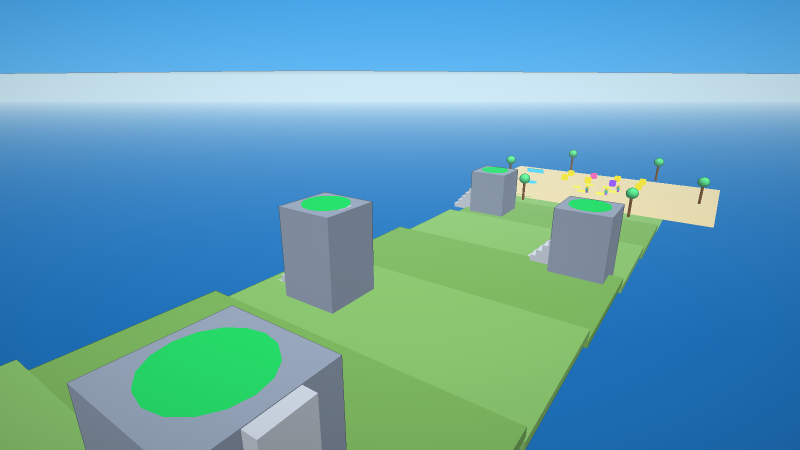 | 11 | **Lucky Kick Run** | ラッキーブロックをけとばして何が出るかな？アイテムを手に入れたら、せまる大津波から高台へにげろ！ |
| 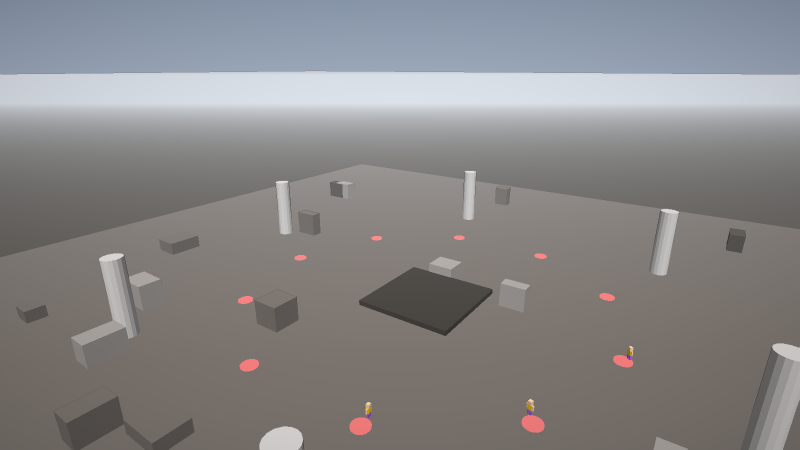 | 12 | **Battleground Legends** | パンチ、アッパー、衝撃波、そして必殺の覚醒！技を組み合わせてオープンフィールドで戦う爽快バトル。 |
| 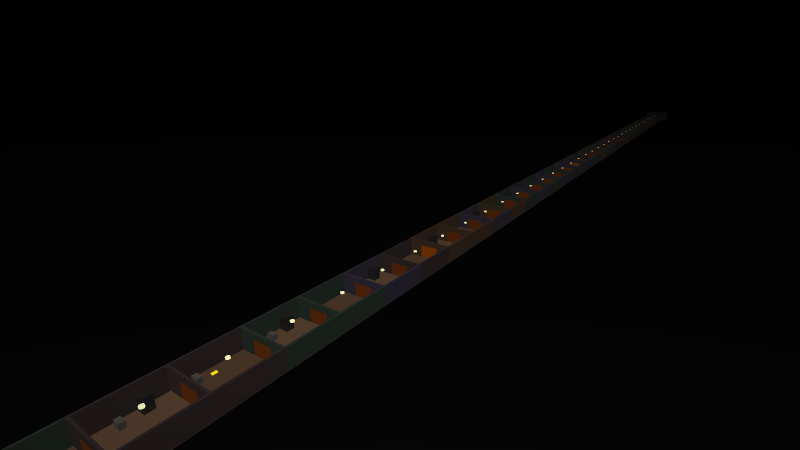 | 13 | **Hotel 100 Doors** | なぞのホテルの100の部屋を進むホラー。明かりがチカチカしたらクローゼットへ！紫の目は見ちゃダメ。カギを見つけて先へ。 |
| 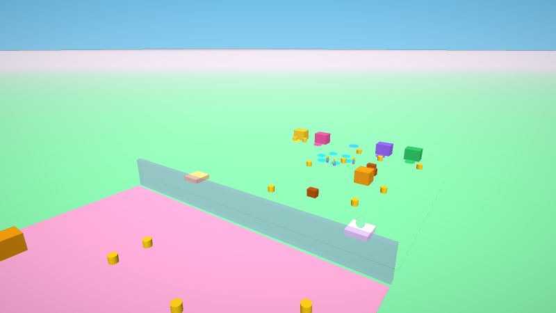 | 14 | **Pet Coin Frenzy** | コインの山をタップしてこわし、たまごからペットを出してパワーアップ。新しいエリアを開いて、巨大ペットを引き当てろ！ |
| 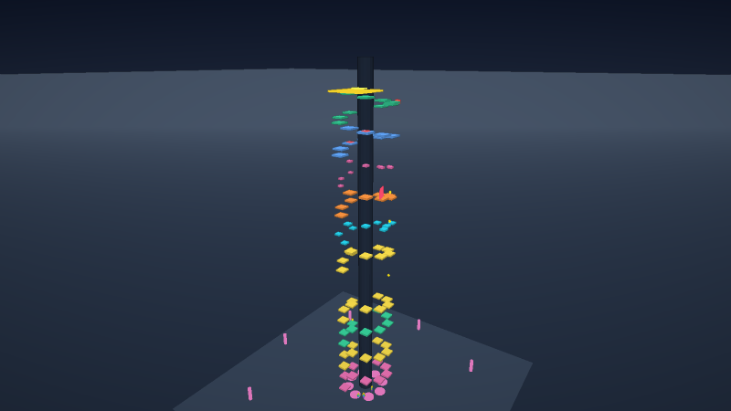 | 15 | **Tower of Chaos** | チェックポイントなしの超むずかしいタワー。毎回ランダムに組み上がる障害物を、時間内にてっぺんまで登りきれ！ |
| 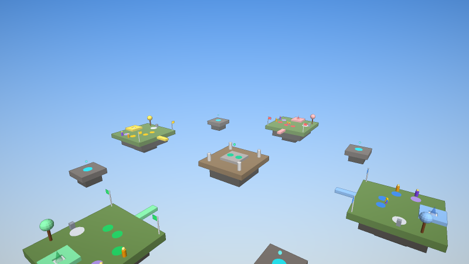 | 16 | **Crystal Wars** | 浮島でチームに分かれて自分のクリスタルを守り、相手のクリスタルをこわせ。ブロックで橋をかけて、装備を強化して攻めこもう。 |
| 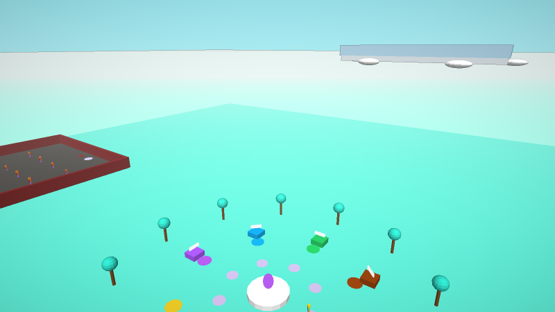 | 17 | **Slime Roll** | 運だめしでスライムを引こう。レアなスライムほど強くて、勝手に戦ってコインをかせいでくれる。100万分の1を引けるか？ |
| 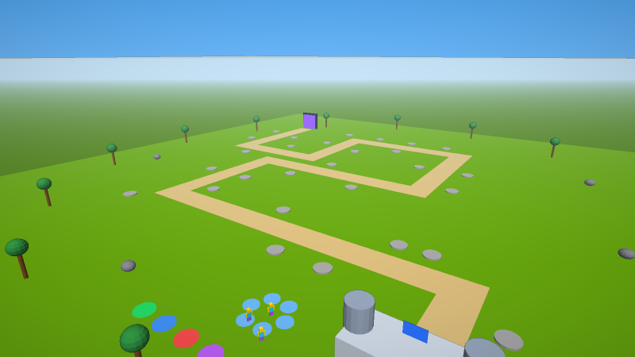 | 18 | **Hero Tower Defense** | 道の横にヒーローを置いて、せまる敵の大群を止めろ。剣士、弓使い、魔法使い、氷使い。強化のタイミングが勝負のカギ。 |
| 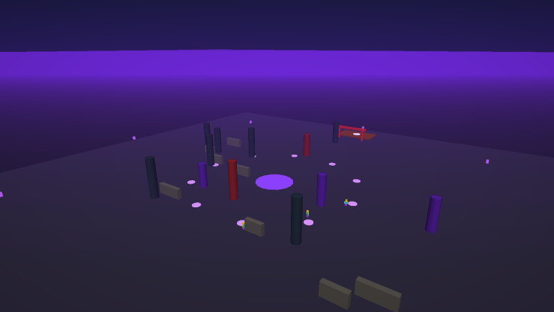 | 19 | **Domain Clash** | 炎・雷・重力・影の術で戦うバトル。ゲージがたまったら「領域展開」で相手を閉じこめろ！地面や柱もこわれる。 |
| 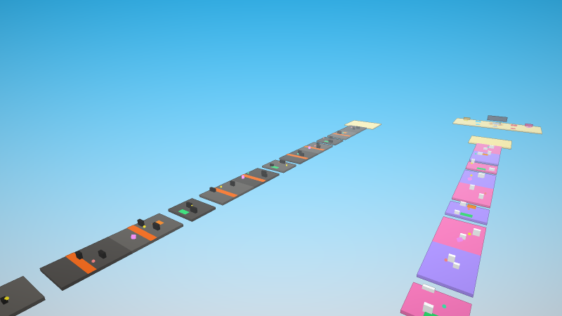 | 20 | **Tsunami Dash** | うしろからせまる巨大な津波！障害物をかわし、アイテムを拾いながらゴールまで走りぬけろ。ミームだらけのにぎやかコース。 |

### ⚔️ アクション・バトル

| | # | ゲーム | 内容 |
|---|---|---|---|
| 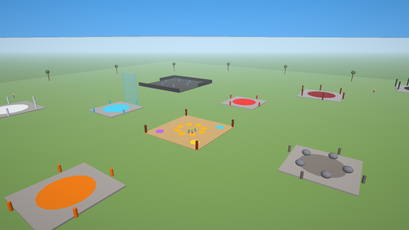 | 21 | **Power Training Sim** | 力・気・速さ・耐久の4つを修行できたえる育成バトル。岩場や滝の修行場でパワーアップして、ボスや友だちと戦おう。 |
|  | 22 | **Deflect Ball** | ねらった相手を追いかける光のボール。ギリギリで「はじく」を押して打ち返せ！最後まで残った人の勝ち。 |
| 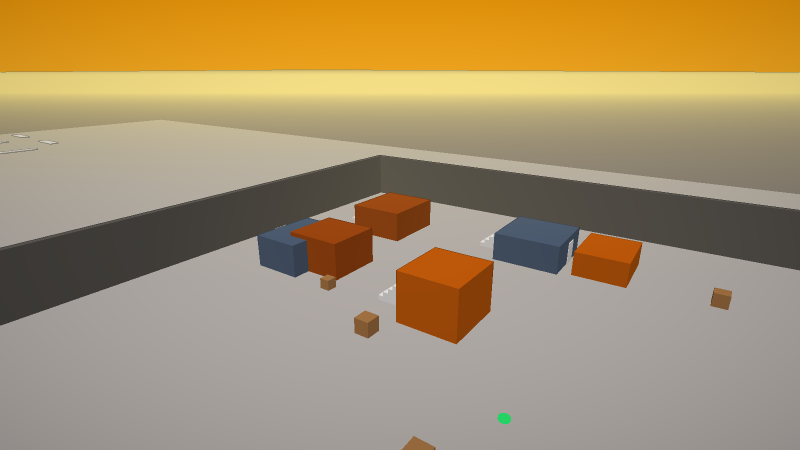 | 23 | **Gun Swap Arena** | たおすたびに武器が変わるスピードFPS。12の武器を順番にクリアして、最後の黄金ナイフで決めた人の勝ち。 |
| 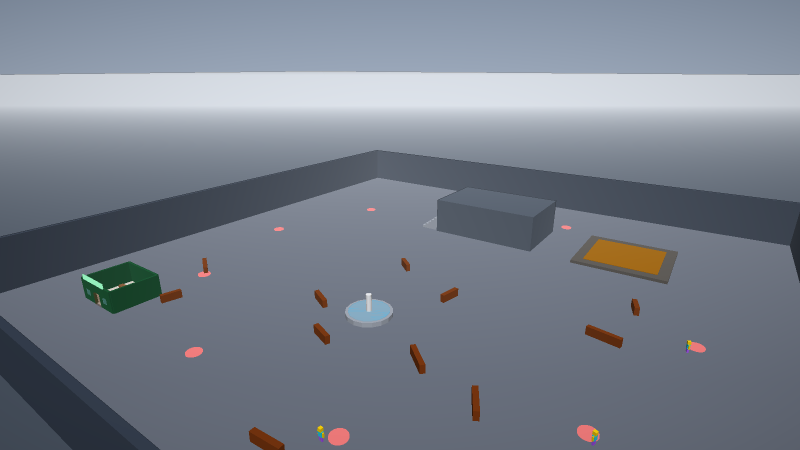 | 24 | **Warrior Brawl** | やり・大剣・刀・爆弾で戦う近接バトル。タイミングよく「はじく」で相手をよろめかせ、回避と包帯で生きのこれ。 |
| 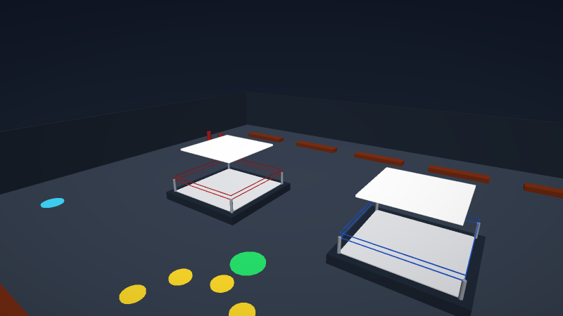 | 25 | **Ring Boxing League** | リングで1対1のボクシング。ジャブ、ストレート、アッパー、ガード。スタミナを考えて打ち合い、ランキングを上げよう。 |
| 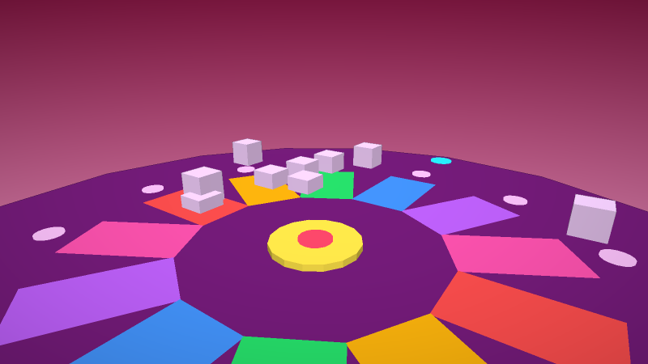 | 26 | **Power Roulette** | ラウンドごとにルーレットで能力が決まる！炎、巨大化、ワープ、分身…運と工夫で最後まで生きのこれ。 |
| 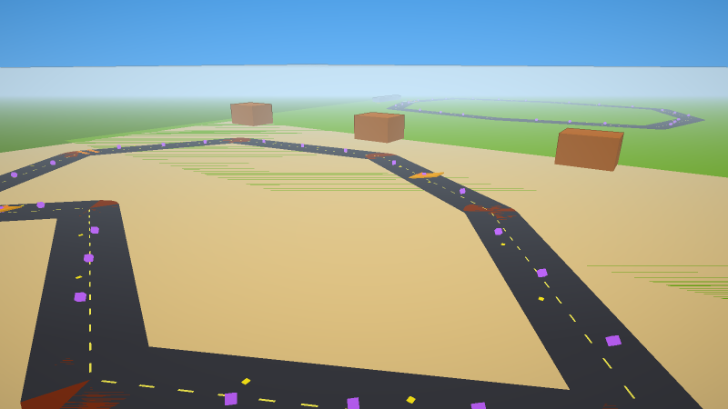 | 27 | **Armed Racers** | 武装したレースカーでコースを3周。アイテム箱からミサイル、オイル、ブーストを手に入れて、ライバルをじゃましろ！ |
| 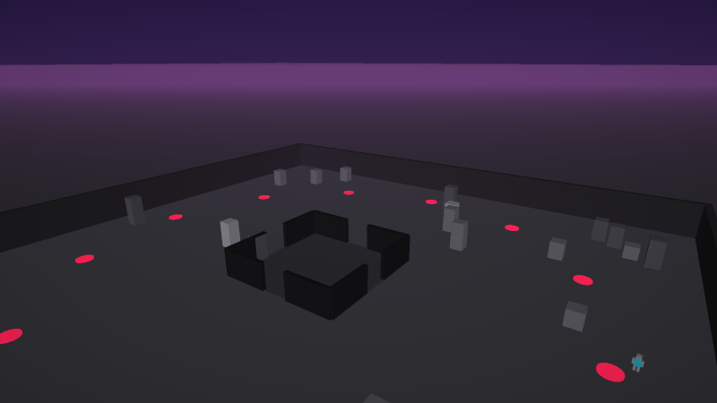 | 28 | **Blade & Revolver** | ナイフとリボルバーだけのデスマッチ。ナイフは投げることもできる。先に20キルした人の勝ち。 |
| 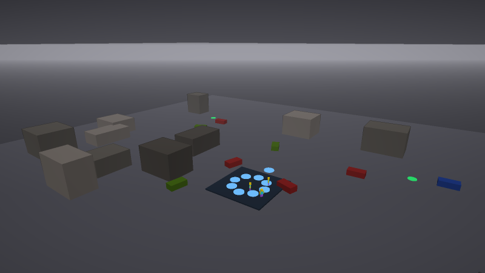 | 29 | **Last Squad vs Horde** | 人間チームとゾンビの大群のサバイバル。やられた人間はゾンビになる！3分間生きのびて、ヘリで脱出せよ。 |
| 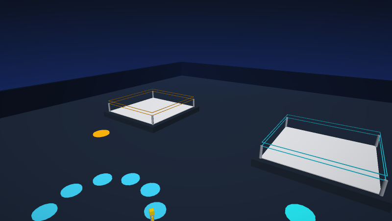 | 30 | **Style Boxing** | スピード、パワー、タンク、カウンター。自分のスタイルを選んで、必殺技ゲージをためて殴り合うボクシングバトル。 |
| 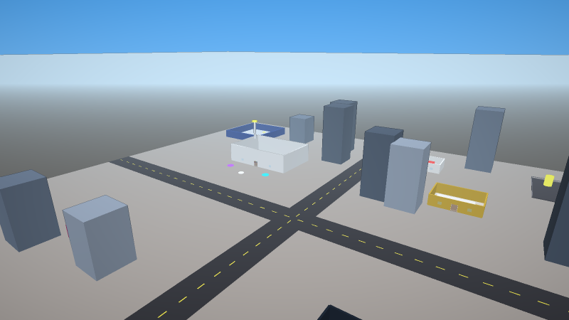 | 31 | **Hero Academy Sim** | ヒーローかヴィランか。16の個性をガチャで集めて熟練度を上げ、事件の解決や金庫やぶり、停電、改造怪人との戦い、昇格試験に挑む。 |
| 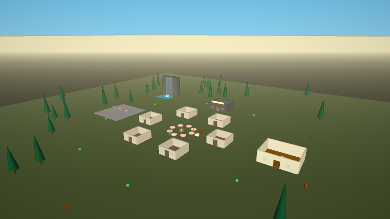 | 32 | **Oni Blade** | 夜になると鬼が村をおそう。7つの流派の型をきわめ、刀をきたえて家を守れ。4夜ごとに土蜘蛛や酒呑童子など昔話の鬼の大将があらわれる。 |

### 🏡 ロールプレイ・生活

| | # | ゲーム | 内容 |
|---|---|---|---|
| 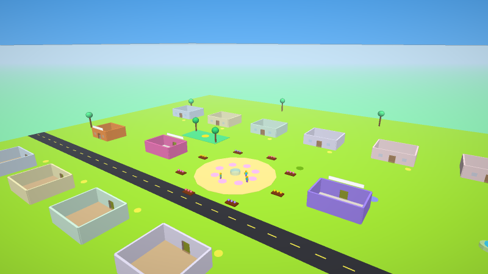 | 33 | **Pom Town** | 家を家具でかざって★5のおうちに。タマゴからかえる15種類のポムをお世話して伝説まで育てよう。釣り・配達・水やりでスターを集めて、パーティーとおうちコンテスト！ |
| 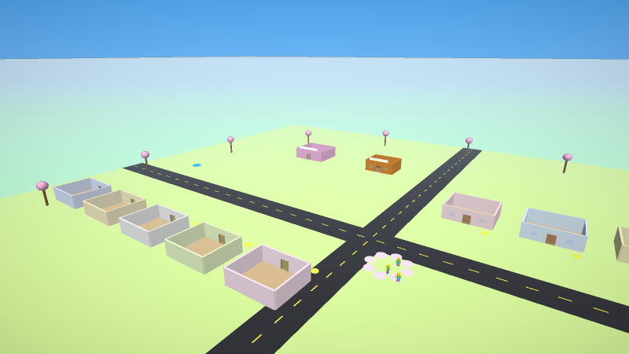 | 34 | **Cherry Lane RP** | 学校と家族とお仕事のロールプレイ。チャイムで授業（クイズ・音楽・体育）に出て通知表で進級・卒業。家族をつくって赤ちゃんのお世話、カフェ店員や美容師でお給料、服と乗り物も。 |
| 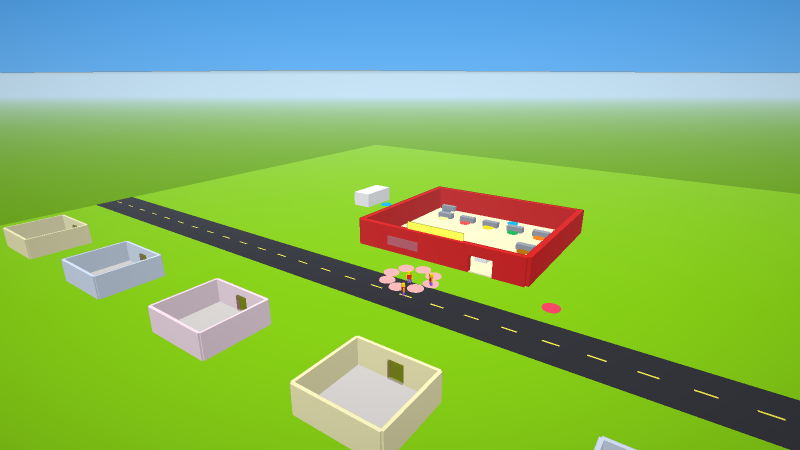 | 35 | **Pizza Shift** | ピザ屋でみんなで働こう。レジで注文、レシピどおりに具をのせて、こげる前にオーブンから出して手わたし・配達！ ★評価と店のお金で店を強化、昇進で給料アップ。 |
| 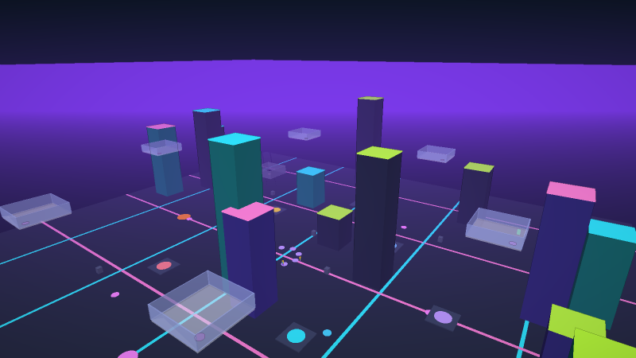 | 36 | **Neo City Life** | 未来都市のRP。6つの仕事（修理・救助・逮捕・料理・空の配達・ハッキング）でかせぎ、乗り物を集めて空の家をスマートホームに。指名手配と刑務所、ドローンレース、ネオンナイトも。 |
| 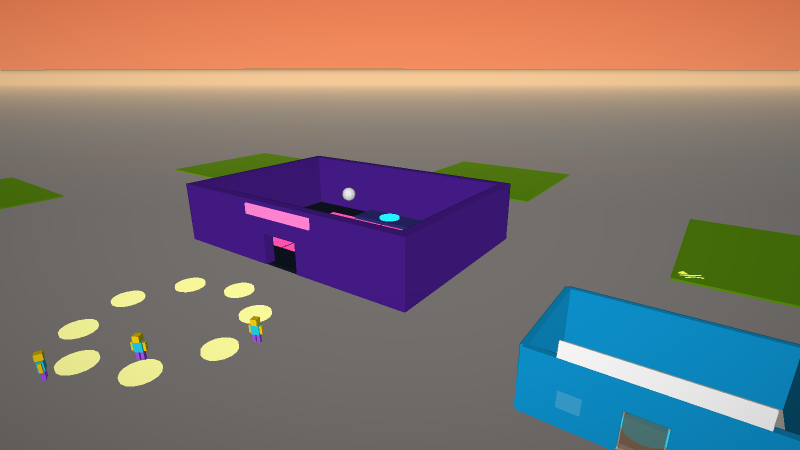 | 37 | **Club Hangout** | 空き地に20種類のパーツで家を建て、家族といっしょに作ろう。クラブではDJがジャンルを選び、リズムに合わせておどってコインを。家の見学といいね、ハウスツアーも。 |
| 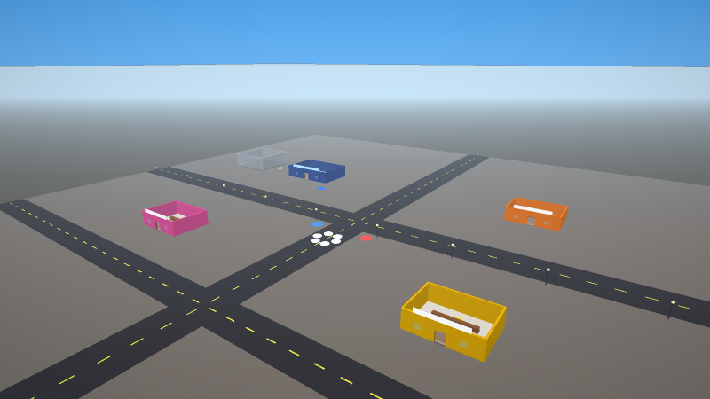 | 38 | **Ridgeport Cops & Robbers** | 警察と強盗の街アクション。ガソスタ・宝石店・銀行の暗証番号・銃砲店・現金輸送車をねらう強盗と、テーザーと手錠で追う警察。階級・武器・車・脱獄・保釈も！ |
| 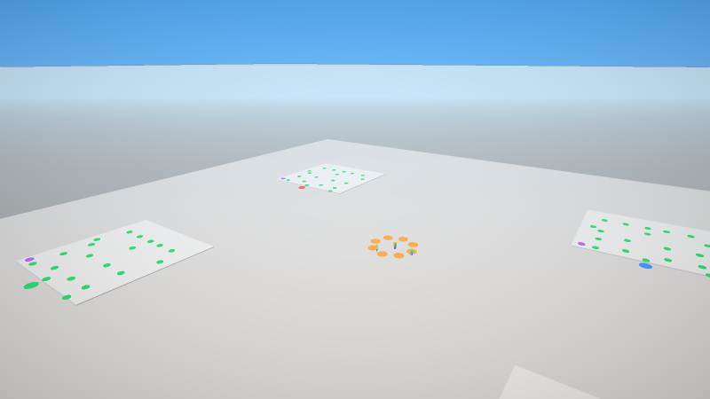 | 39 | **Dinner Rush Tycoon** | レストランを経営。19の設備で6品のメニューを増やし、シェフとウェイターをやとって自動化。評判と料理評論家、2号店（リバース）で永久ボーナス！ |
| 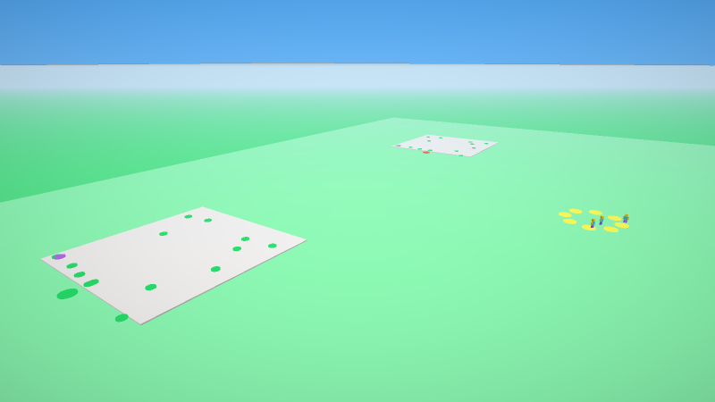 | 40 | **Coaster Park Tycoon** | 遊園地を作ろう。14のアトラクションと屋台、お客さんの楽しさ・空腹・のど・トイレ、入場料、故障の修理とゴミそうじ、スタッフ、ベストパーク賞。自分でも乗れる！ |
| 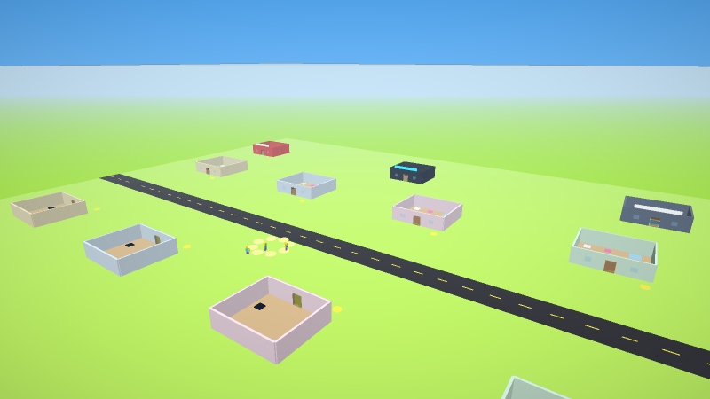 | 41 | **Life Ville** | 5つのゲージと気分を整えながらくらすライフシム。オフィス・キッチン・公園・ジムの4つの仕事と昇進、料理・体力・創作・頭脳のスキル、家具のグレードアップ、お祭りも。 |
| 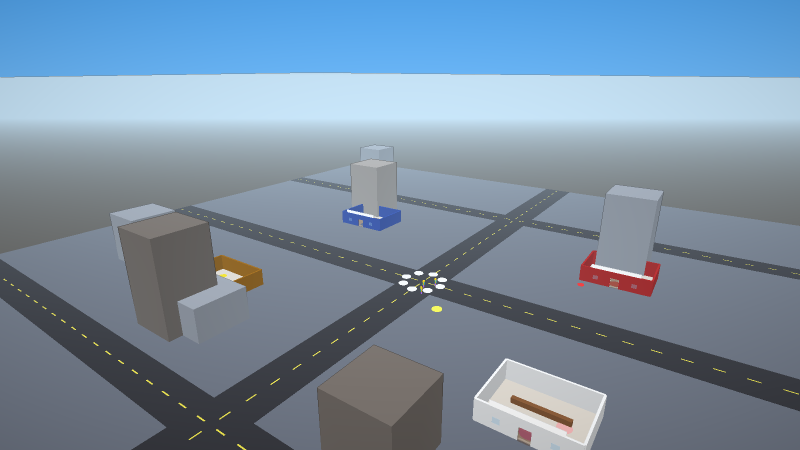 | 42 | **Metro Response** | 警察・消防・救急・市民・犯罪者に分かれる街のRP。出動指令を受けて、火事を消し（水タンクと消火栓）、けが人を病院へ、犯人を手錠で確保。倒れた仲間の蘇生、タクシー、金庫やぶりも。 |
| 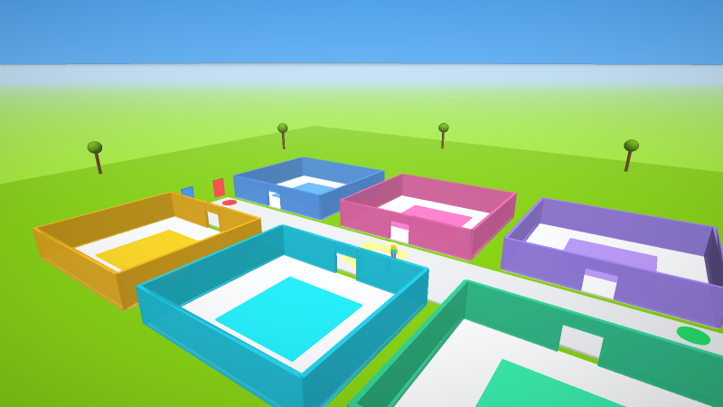 | 43 | **Academy Days** | 4つの寮に分かれる学園生活。チャイムで6つの教室へ（算数・美術・音楽・体育・ポーション学・図書館）。宿題と部活で寮ポイント、寮杯と生徒会選挙も！ |
| 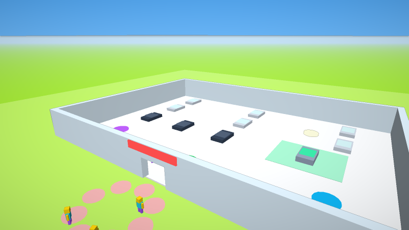 | 44 | **Willow Hospital RP** | 病院のお仕事RP。医者・看護師・外科医・薬剤師・救急隊・患者に。トリアージ、バイタル、12の病気の診断、薬の調合、手術、救急車の出動。病院の資金でベッドや設備を強化！ |
| 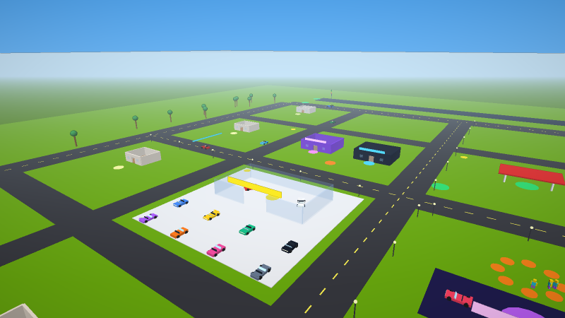 | 45 | **Street Drive Empire** | 車を集めて街を走るドライブゲーム。16台の車を買って色とパーツをカスタム。4つのレース（サーキット・ドラッグ・市街地・ラリー）でライバルと勝負、配達とタクシーでかせいでライセンスを上げよう！ |

### 👻 ホラー・サバイバル

| | # | ゲーム | 内容 |
|---|---|---|---|
| 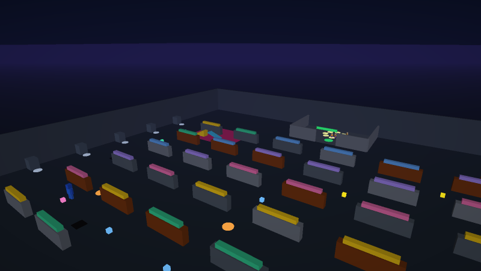 | 46 | **Color Monsters** | 夜のおもちゃ倉庫で5色のモンスターから隠れて、夜ごとの任務（ブロック・ヒューズ・電池・ガス・ロケットの部品）を集めよう。箱やロッカーに隠れ、つかまった仲間は檻から助けて、5夜目にロケットで脱出！ |
| 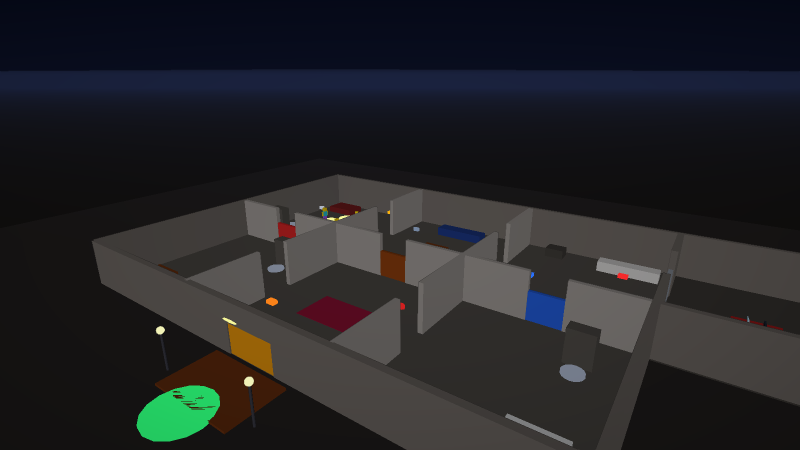 | 47 | **Porky's House** | 毎回ちがう場所にあるカギ・ハンマー・レンチを見つけてドアを開け、玄関（出口のカギ＋暗号）か車庫の車で脱出するなぞ解きホラー。ブタの怪物はわなをしかけて追ってくる。クローゼットに隠れて、幽霊になっても仲間を助けよう！ |
| 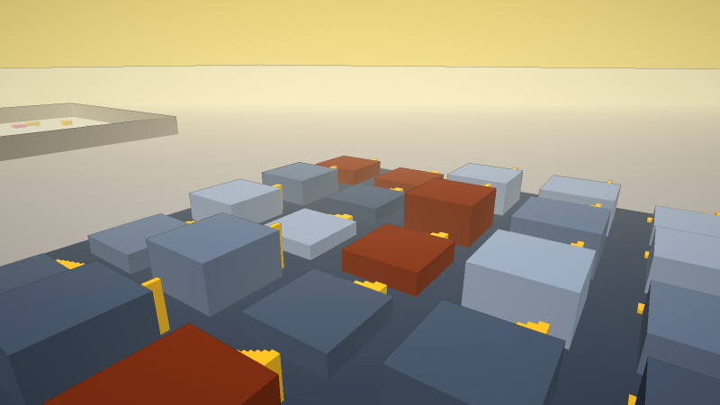 | 48 | **Run From The Faces** | 5種類の巨大な顔（ダッシュ・ワープ・ジャンプ・分裂）が追いかけてくる！ ダッシュとアイテムで逃げて、倒れた仲間は助け起こそう。モール・屋上・迷路・公園の4ステージを投票で。3分生きのびたら勝ち！ |
| 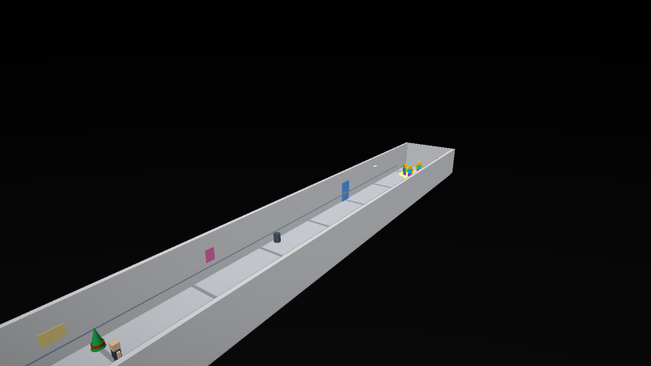 | 49 | **Anomaly Hallway** | 終わらない駅の廊下。30種類の「異変」— 色・位置・数・おじさんの動き・せまる赤い波 — を見つけたら引き返し、なければ進む。8回続けて正解で出口へ。異変図鑑を集め、最速記録と裏モードにも挑戦！ |
| 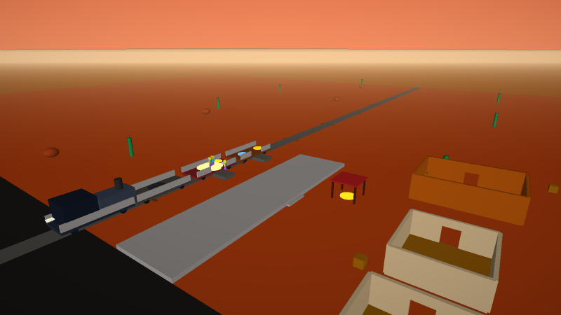 | 50 | **Last Train West** | 荒野を走る最後の列車で10kmの旅。石炭をくべて走らせ、4つの町（ゴーストタウン・銀行・教会・砦）で物資と金塊を集め、夜の怪物とならず者から列車を守れ。役割と列車の強化、最後は大きな橋の防衛戦！ |
| 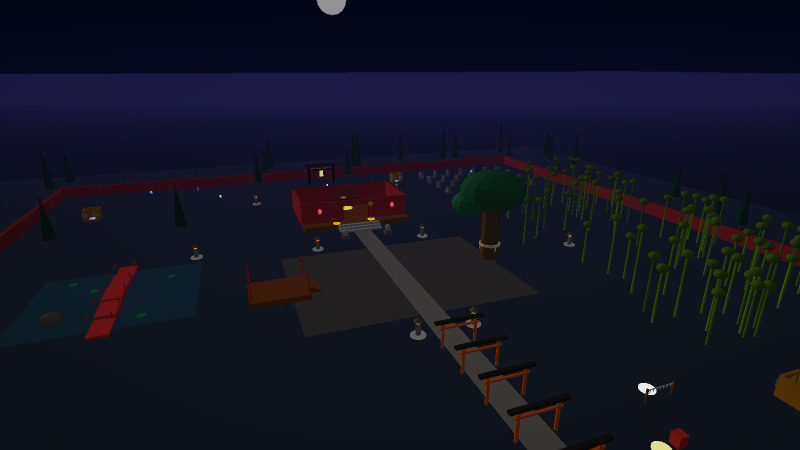 | 51 | **Yokai Shrine** | 夜の神社でお札を集めて本殿に納める、三つの夜の和風ホラー。仲間に化けるのっぺらぼう・灯籠を消す狐火・お札をうばうからかさ・池のかっぱ、そして最後は目ざめた鬼から鳥居の外へ逃げろ。勇気・おみくじ・お守り・妖怪図鑑！ |
| 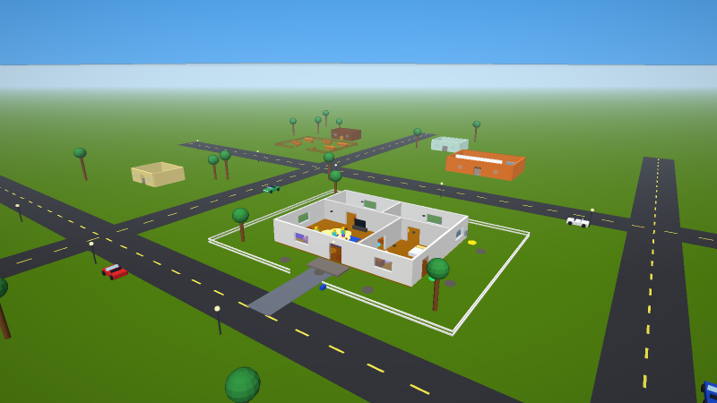 | 52 | **Night Lockdown** | 昼は町の6つのお店で板・釘・鉄板・食料・燃料を集め、夜は家の窓とドアに板を打って立てこもる。わな・作業場・発電機、5種類の侵入者。おばあちゃん・妹・犬を守って5日目の救助ヘリへ！ |
| 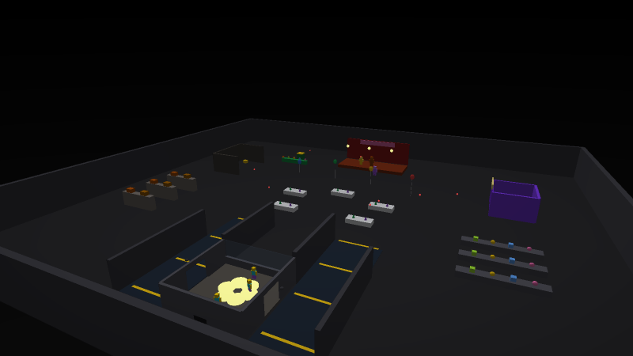 | 53 | **Toy Factory Night Shift** | おもちゃ工場の夜間警備。9台のカメラ・左右のドアとライト・通気口で、歩きまわるクマ・ウサギ・ニワトリ、見られないと飛び出すキツネ、オルゴールが止まると開くびっくり箱から身を守れ。電力を節約して朝6時まで。6夜目はナイトメア！ |
| 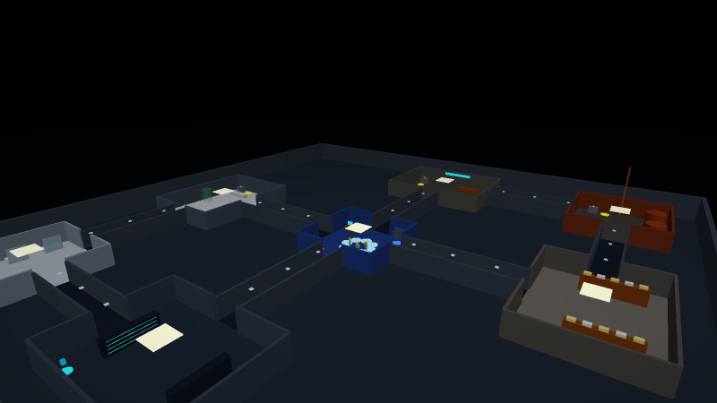 | 54 | **Midnight Guard** | 真夜中の研究施設の警備員になって3つの夜を見回る。所長の巡回リスト（ニセの無線に注意）、6つの棟の発電機と燃料運び、電池つきのライトで影を消し、見張る者・迷子・停電の王に立ち向かえ。 |
| 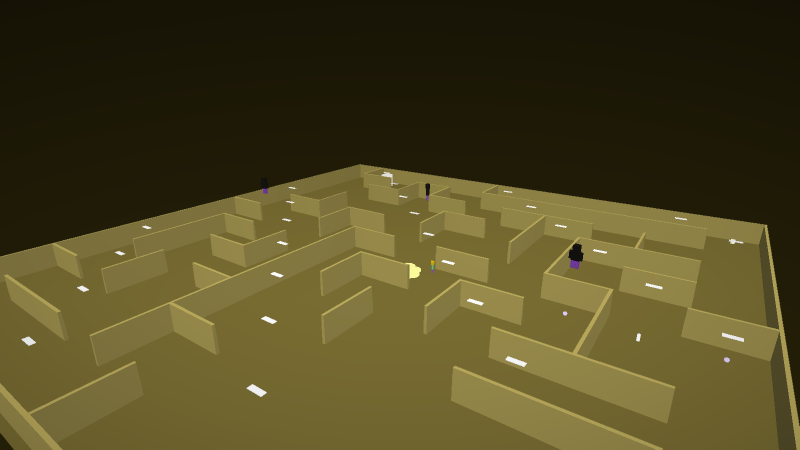 | 55 | **Endless Rooms** | 黄色い部屋の迷路から、倉庫・パイプ・電気室・空きオフィス・終わらない廊下へ。レベルごとに出口のなぞ（ヒューズ・バルブ・ブレーカー）と別の「何か」。正気度とアーモンド水、メモと記憶のかけらを集めて外の世界へ！ |
| 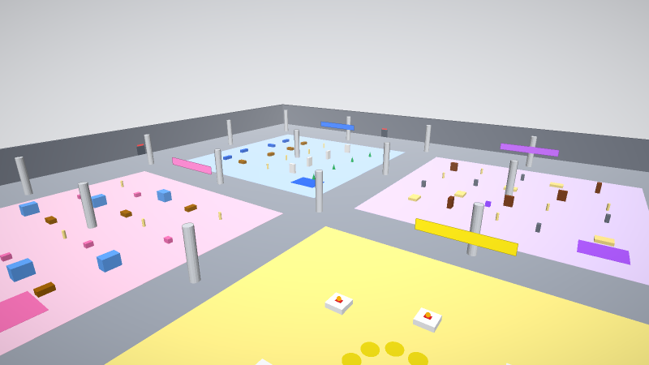 | 56 | **Infinite Store** | 終わりのない巨大家具店。9つの売り場で家具を拾って基地を作り、夜は家具をこわしてくる店員（3日目と6日目は店長！）から守れ。おなか・武器の箱・落とし物・サービスカウンター。7日目の閉店で出口が開く！ |
| 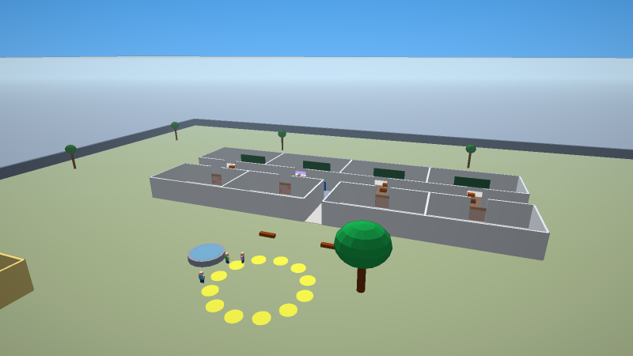 | 57 | **Smile Outbreak** | 笑顔がうつる学校の鬼ごっこ。3つのモード（アウトブレイク・さいごの一人・特効薬ラッシュ）を投票、4つの役割の技、ロッカーにかくれ、教室のドアを閉め、ワクチン銃で元にもどせ。笑顔は とびかかる・高笑い で追いつめる！ |
| 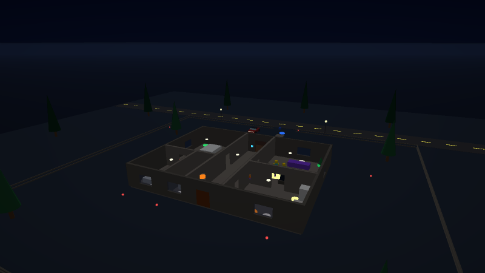 | 58 | **Watch The House** | 田中さん一家の家で5日間の留守番。窓にひびを入れにくるものをカメラで探してライトで追い払い、玄関の来客はご近所リストとくらべてニセものを見やぶれ。家のしごと・猫のタマ・停電・スマホ通販も！ |

### 🏗️ 放置・ガチャ・タイクーン

| | # | ゲーム | 内容 |
|---|---|---|---|
| 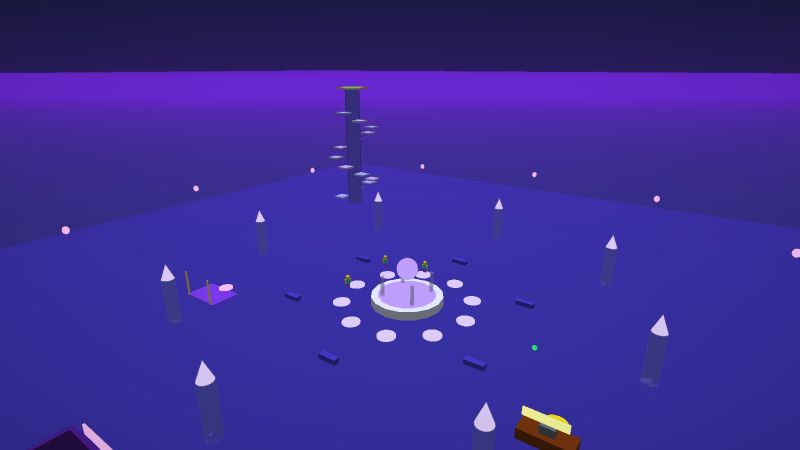 | 59 | **Aura Roll** | ボタンでオーラを引く運だめし。32種のオーラ、8つの天気（その天気だけのオーラ）、素材とオーラでギアをクラフト、旅の商人のポーション、運の塔。10回ごとのボーナスで1億分の1を引き当てろ！ |
| 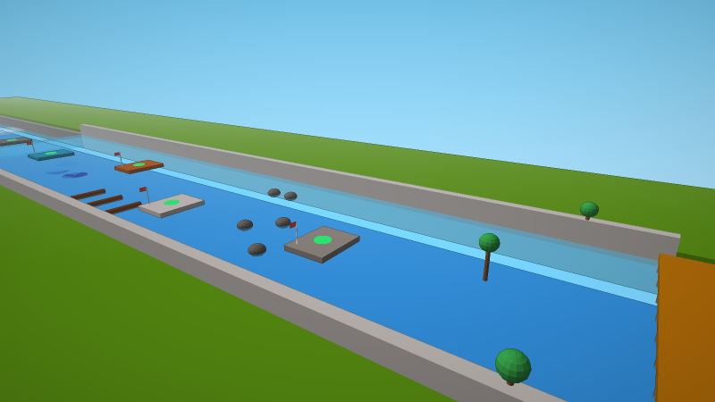 | 60 | **Raft to Treasure** | ブロックで橋を作って川を下る工作アドベンチャー。岩・流れる丸太・うずしお・滝・ワニの沼・氷・溶岩の10ステージ。8つの材料を解放し、大洪水の前に宝島の宝箱へ。タイムもきそおう！ |
| 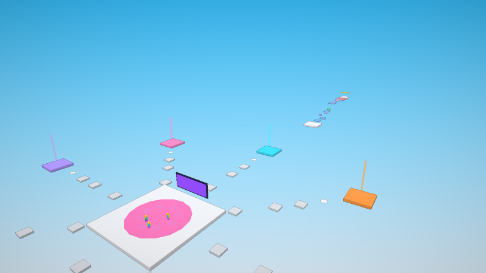 | 61 | **Obby Maker** | 自分だけのアスレチックコースを作って公開しよう。17種のパーツ（動く床・回る溶岩バー・ワープ・コインも）、グリッドと回転、テストでクリアして公開、タイムといいね。お手本コースやみんなのコースに挑戦！ |
| 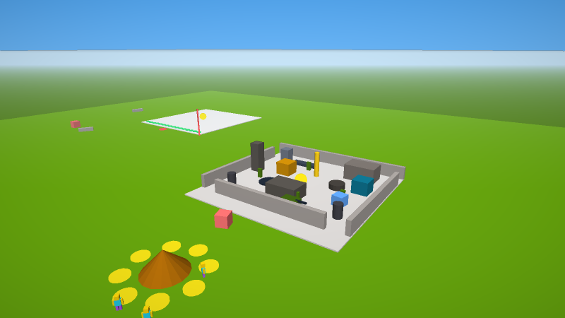 | 62 | **Toy Army Tycoon** | おもちゃの軍隊の基地を16の設備で大きくするタイクーン。兵隊・戦車・タレット・狙撃塔・迫撃砲・空爆で、予告つきの襲撃（5回ごとにおもちゃ将軍）からコアを守れ。研究所・銀行・昇進も！ |
| 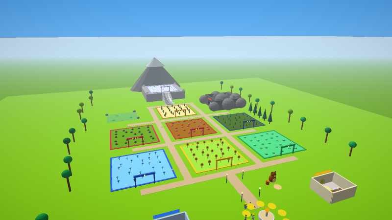 | 63 | **Buzz Meadow** | ハチを育てて花粉をハチミツに。12種のハチ（赤・青の花畑が得意なハチも）、8つの花畑、たまごとロイヤルゼリー、道具とバッグ、トークン、虫たいじと洞くつのカブトムシの王、くまさんの9つのクエスト！ |
| 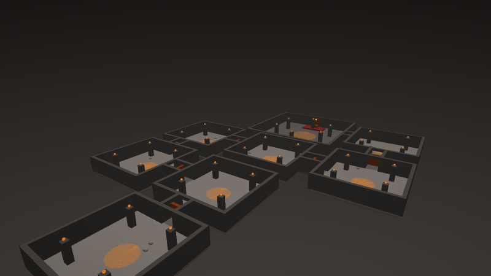 | 64 | **Dungeon Delve** | 4つの職業で挑む協力ハクスラ。部屋ごとに戦い・強敵・宝物庫・祭壇・ワナ・休けい所、奥にはボス。4つのテーマと4体のボス、5段階のレア装備、12の遺物、鍛冶屋で強化してもっと深い階へ！ |
| 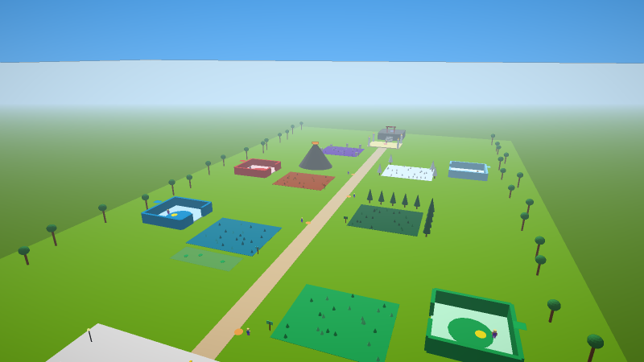 | 65 | **Critter Quest** | 草むらでクリッターに出会って、つかまえて、育てるターン制RPG。24種（進化あり）、9タイプの相性、31の技と状態異常、4人のリーダーとチャンピオン、図鑑とあずかりボックス、そして伝説のクリッター！ |
| 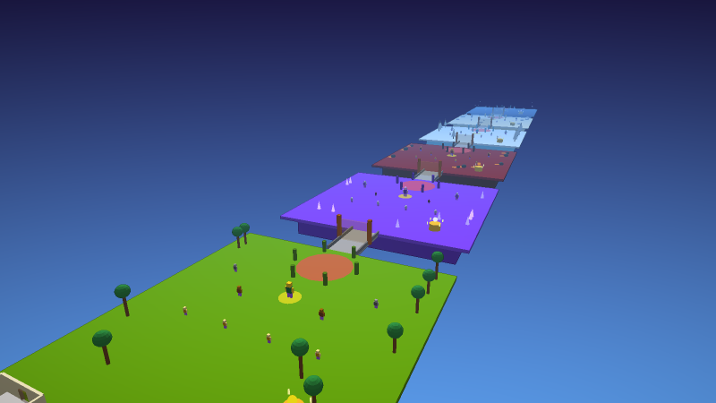 | 66 | **Blade Summon Sim** | 召喚した武器がまわりを回って敵を自動でたおす放置系。6つのワールドと36本の武器、6段階のレア度、★合体、エンチャント、道場の強化、ワールドボス、転生と転生ショップ！ |
| 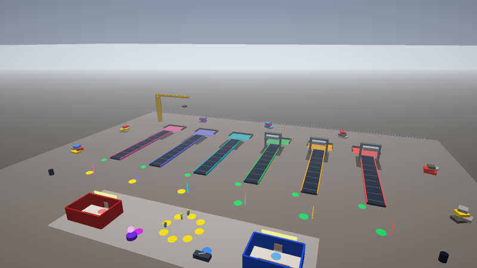 | 67 | **Crusher Yard** | 自分のレーンで車をグシャッ！ 12台の車（部品ごとにこわれる）と6つの機械（プレス・シュレッダー・溶岩・レーザー・鉄球・ブラックホール）。スクラップ集め・磁石・自動投入・転生・スクラップラッシュ！ |
| 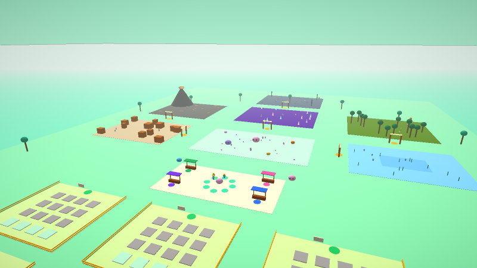 | 68 | **Slime Merge** | スライムをすいこんで、自分の牧場の台で合体！ 8種類×10レベル、7つのバイオームとゲート、台16こ、自動合体、たまご屋と市場、図鑑80こ、スライムの雨とにげ足の速いにじいろスライム！ |
| 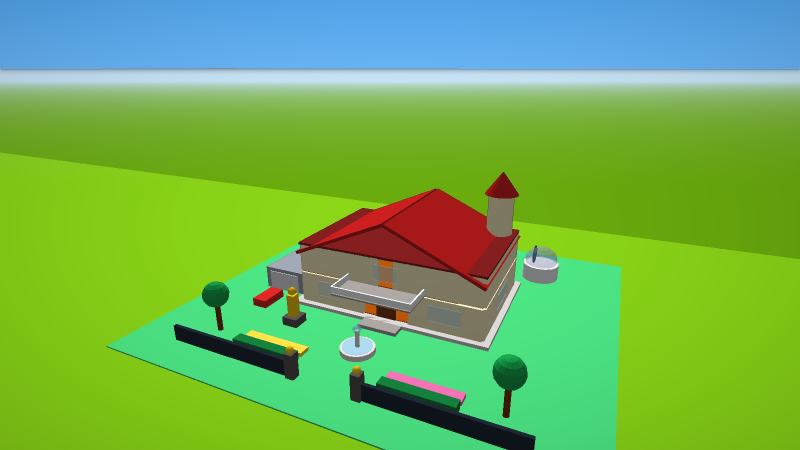 | 69 | **Mansion Builder Tycoon** | 土台から26段階で大豪邸が立ち上がるタイクーン。家賃は郵便受けに、執事で自動回収、投資、壁と屋根のペンキ、パーティーのゲストのチップ、豪邸コンテスト、完成したら売って転生！ |
|  | 70 | **+1 Speed Wall Escape** | 1秒ごとにスピードが+1！うしろからせまる巨大なかべから逃げて、どこまで遠くへ行けるか。転生でさらに速く。 |

### 🏃 アスレチック・ミニゲーム

| | # | ゲーム | 内容 |
|---|---|---|---|
| 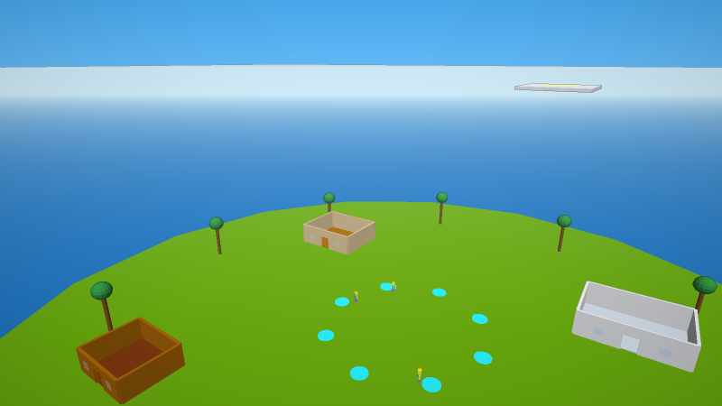 | 71 | **Disaster Island** | 島に次々とおそいかかる自然災害！洪水、いん石、たつまき、地震、酸性雨…生きのびるたびにポイント。 |
| 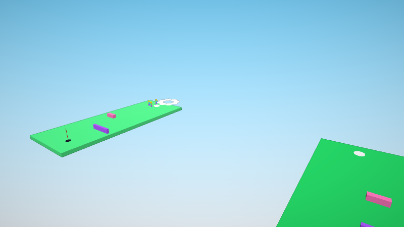 | 72 | **Chaos Golf** | へんてこなコースを回るゴルフ対戦。パワーをえらんで打って、少ない打数でカップイン！全6ホール。 |
| 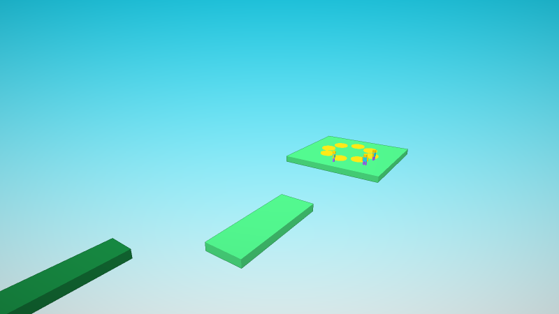 | 73 | **Speed Worlds** | ものすごいスピードで走りぬけるアスレチック。5つの世界をワープでつなぐコースを、最速タイムでクリアしよう。 |
| 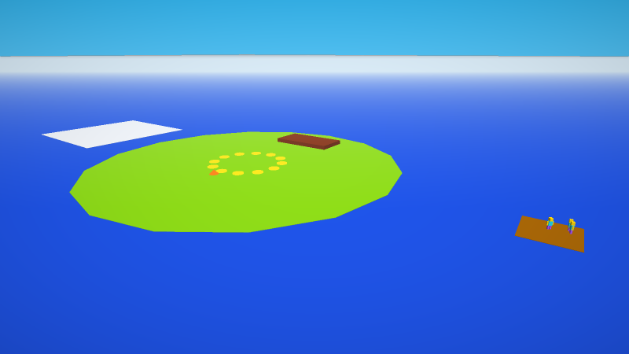 | 74 | **Island Drama Show** | サバイバル番組の出演者になって、毎回ちがうミニゲームで勝ちぬけ！最下位は脱落…最後に残るのはだれだ？ |
| 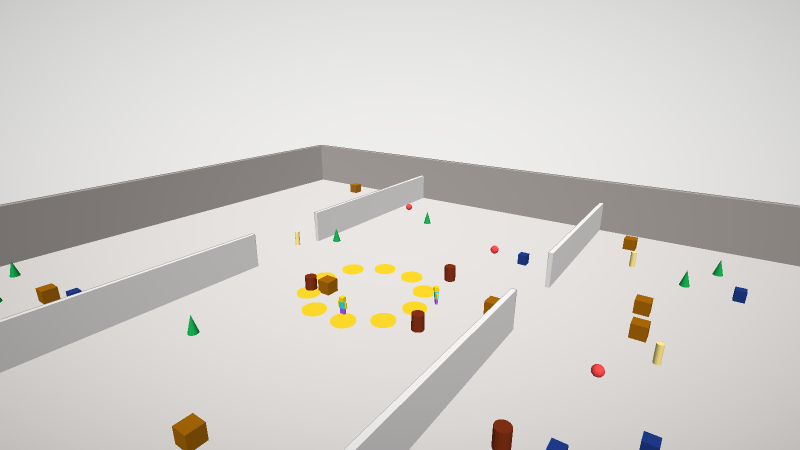 | 75 | **Prop Hide & Seek** | 家具に変身してかくれんぼ！鬼は怪しいものを撃って探す。まちがえると鬼がダメージ。最後まで見つからなければ勝ち。 |
| 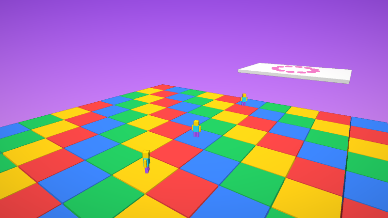 | 76 | **Mega Minigames** | 落ちる床、山の王、色あわせ、玉よけ…次々に出るミニゲームで勝ってポイントを集めよう。 |
|  | 77 | **Rhythm Battle** | 落ちてくるノーツに合わせてボタンを押す、対戦リズムゲーム。パーフェクトを決めて相手より高いスコアを！ |
| 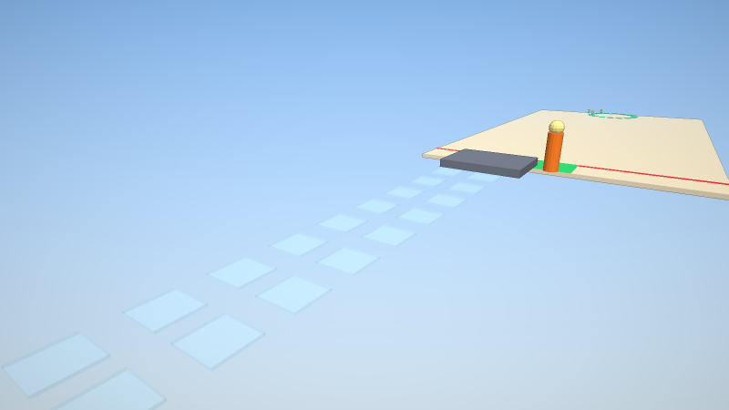 | 78 | **Last Survivor Games** | 「だるまさんがころんだ」とガラスの橋。動いたら失格、まちがえたら落ちる。最後まで生き残れ！ |
| 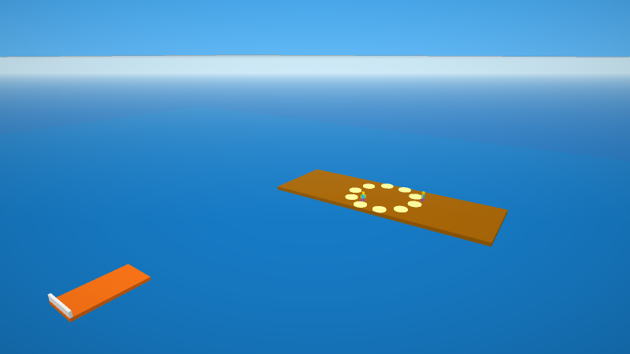 | 79 | **Shark Attack Bay** | 巨大なサメと、ボートに乗った人間の海上バトル。人間はサメを撃退、サメは全員を海に引きずりこめ！ |
| 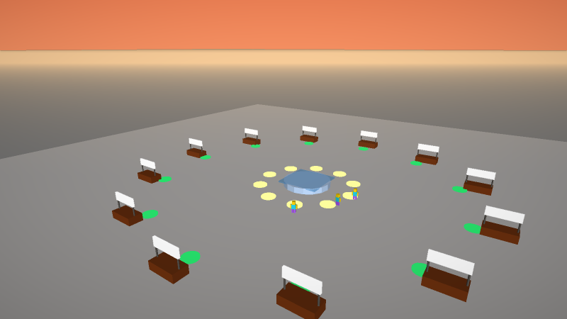 | 80 | **Tip Jar Plaza** | 自分のお店ブースを出して、メッセージを書こう。遊んでたまったチップを、気に入ったブースにプレゼント！（ゲーム内のコインだけです） |

<!-- games:end -->

## しくみ

```
index.json                      アプリが読む一覧
lib/kit.absc                    全ゲーム共通の道具（お金・ショップ・クエスト・レベル・実績・遊び方表示…）
games/<id>/world.ablox          マップ（ブロック）
games/<id>/*.absc               そのゲームのスクリプト（data → ほか → main の順に読む）
games/<id>/cover-<指紋>.png      一覧に出るカバー画像（マップから自動で描く）
games/<id>/listing.json         一覧の1行分
tools/generator/                マップを作るプログラム（Swift）
tools/build.sh                  全部を作り直して、チェックして、自動で遊んで確かめる
```

- 各ゲームは `lib/kit.absc` と `games/<id>/main.absc` の2つの `.absc` を読み込みます
  （`index.json` の `scripts`）。スクリプトを GitHub で直せば、次にダウンロードしたときから反映されます。
- マップは `tools/generator/Maps*.swift` にコードで書いてあります。家・木・道・アリーナなどの
  部品を共有しているので、部品を直すと全部のマップに反映されます。

## 作り直しとテスト

```sh
git clone https://github.com/prak59459-create/Ablox ../Ablox
ABLOX=../Ablox tools/build.sh           # 全部（数分）
ABLOX=../Ablox tools/build.sh --only 12 # 1本だけ
ABLOX=../Ablox tools/build.sh --quick   # 自動プレイを短く
ABLOX=../Ablox tools/build.sh --covers  # カバー画像を全部描き直す（遊ばない）
```

`build.sh` はアプリと同じ `AbloxCore` を一緒にコンパイルして、

1. 全マップを作って `world.ablox` を書く
2. 全スクリプトを文法チェック（Studio の「チェック」と同じ）
3. **ロボットのプレイヤー4人で150秒ずつ遊ぶ** — 画面のボタンを全部押し、テキストを入力し、
   反応するブロックに触れ、タップし、近くの相手を撃ち、チャットし、途中参加・途中退出もする。
   スクリプトのエラーが1つでも出たら失敗
4. `index.json` をアプリと同じ方法で読み直して、全部のリスティングが通るか確かめる
5. カバー画像を描く — そのゲームのマップを斜め上から見た絵に、スポーン地点のプレイヤーを数人。
   ネットから拾った画像ではなくマップそのものなので、遊ぶ中身といつも一致して、マップを直せば絵も変わる。
   ファイル名に絵の「指紋」が入るので、絵が変わるとアプリは新しいカバーを取りに行く

## オリジナルについて

ジャンルは人気の定番ゲームを参考にしていますが、名前・キャラクター・世界観はすべてこのリポジトリ用のオリジナルです。
実在のゲームやアニメ、会社の名前やキャラクターは使っていません。
